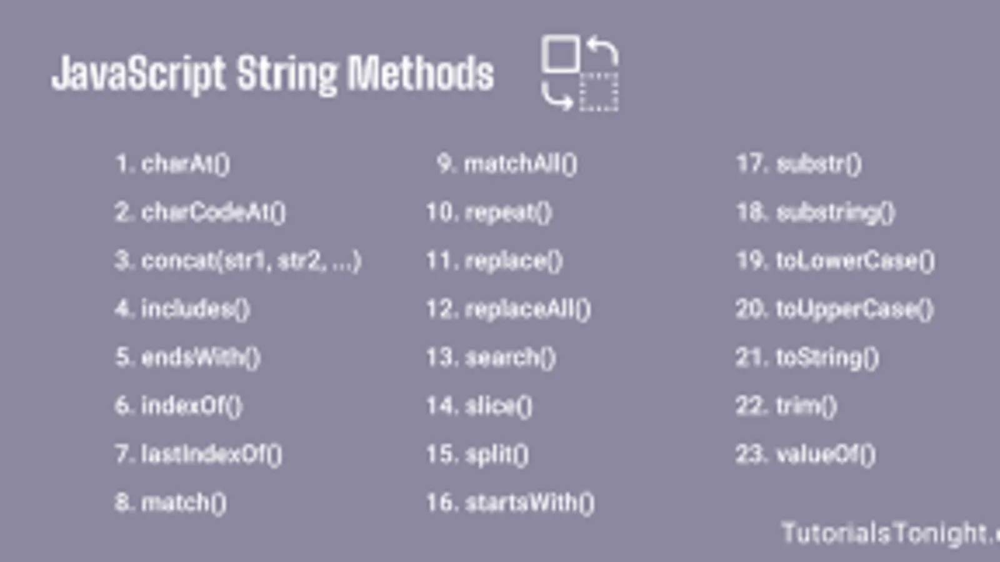
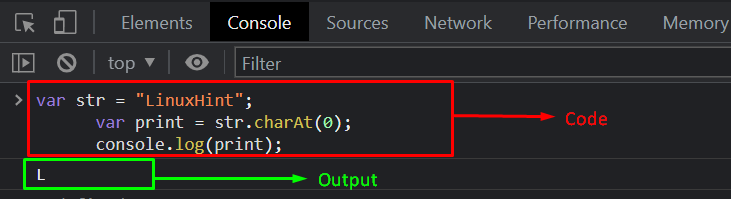

# lecture3-string
# String in JS
## Create string in js
### Double Quotes:
> "Hello"
### Single quotes:
> 'Hello'
### backticks
> `Hello ${hi}` - в таких ковычках можно истпользовать переменную внутри текста

# JS String methods:

### charAt():

> Метод charAt() в JavaScript возвращает символ (строку длиной 1) из указанной позиции в строке. Позиция символа передается в качестве аргумента метода charAt(). Например, если у вас есть строка "hello", и вы вызовете charAt(0), то вернется символ "h", так как индексация символов в строках начинается с нуля. Если вызвать charAt(4), то будет возвращен символ "o", так как это символ на пятой позиции в строке (считая с нуля). Если передать аргумент, который больше или равен длине строки, метод charAt() вернет пустую строку.
### concat():
> Метод concat() в JavaScript объединяет две или более строк в одну новую строку. Он не изменяет исходные строки, а возвращает новую строку, содержащую все символы из исходных строк.

Синтаксис метода concat() выглядит следующим образом:

* str.concat(string2, string3, ..., stringN);
Здесь str - это исходная строка, которая будет объединена с другими строками (string2, string3, ..., stringN).

Например, если у вас есть две строки "Hello" и "world", вы можете объединить их вместе, вызвав метод concat() на первой строке и передав в качестве аргумента вторую строку:

* var str1 = "Hello";
 var str2 = "world";

 var result = str1.concat(str2);

console.log(result); // "Helloworld"
Метод concat() также можно использовать для объединения более двух строк, например:

var str1 = "Hello";
var str2 = "world";
var str3 = "!";
    
var result = str1.concat(" ",str2, str3);

console.log(result); // "Hello world!"

### replace():
> Метод replace() в JavaScript позволяет заменить часть строки другой строкой или регулярным выражением.

* Синтаксис метода replace() выглядит следующим образом:

str.replace(regexp|substr, newSubstr|function)
Здесь str - это исходная строка, которую нужно изменить.

Первый аргумент regexp|substr может быть либо строкой, либо регулярным выражением, которое будет использоваться для поиска подстроки в строке. Если аргумент является строкой, то он будет просто заменен на новую строку.

* Второй аргумент newSubstr|function - это строка или функция, которая будет использоваться для замены найденной подстроки. Если аргумент является строкой, то он будет просто использован в качестве замены найденной подстроки. Если аргумент является функцией, то он должен возвращать строку, которая будет использована в качестве замены.

Например, если у вас есть строка "Hello, World!", и вы хотите заменить слово "World" на слово "JavaScript", можно использовать метод replace() следующим образом:

var str = "Hello, World!";
var newStr = str.replace("World", "JavaScript");

console.log(newStr); // "Hello, JavaScript!"
Метод replace() также может использоваться с регулярными выражениями. Например, если у вас есть строка "10 apples and 5 oranges", и вы хотите заменить все числа на слово "number", можно использовать следующий код:

var str = "10 apples and 5 oranges";
var newStr = str.replace(/\d+/g, "number");

console.log(newStr); // "number apples and number oranges"
> Здесь регулярное выражение /d+/g используется для поиска всех последовательностей цифр в строке.
### replaceAll()
> Он похож на метод replace(), но в отличие от него заменяет все вхождения подстроки, а не только первое.

> Синтаксис метода replaceAll() выглядит следующим образом:

* str.replaceAll(searchValue, replaceValue)
Здесь str - это исходная строка, которую нужно изменить.

Первый аргумент searchValue - это подстрока, которую нужно найти и заменить.

Второй аргумент replaceValue - это строка, которой нужно заменить найденные подстроки.

Например, если у вас есть строка "Hello, world! Hello, JavaScript!", и вы хотите заменить все вхождения слова "Hello" на слово "Hi", можно использовать метод replaceAll() следующим образом:

var str = "Hello, world! Hello, JavaScript!";
var newStr = str.replaceAll("Hello", "Hi");

console.log(newStr); // "Hi, world! Hi, JavaScript!"

### split():
> Метод split() в JavaScript преобразует строку в массив, разбивая ее на элементы с помощью определенного разделителя и возвращает этот массив. Исходная строка не изменяется.

> Синтаксис метода split() выглядит следующим образом:

str.split(separator, limit)
Здесь str - это исходная строка, которую нужно разбить на части.

* Первый аргумент separator - это разделитель, который будет использоваться для разбиения строки на элементы массива. Это может быть строка, символ или регулярное выражение.

* Второй аргумент limit (опциональный) - это число, которое указывает максимальное количество элементов в массиве после разбиения. Если этот аргумент опущен или равен нулю, то метод split() создаст массив со всеми элементами, полученными в результате разбиения строки.

Например, если у вас есть строка "Hello, world!", и вы хотите разбить ее на слова, можно использовать метод split() следующим образом:

var str = "Hello, world!";
var arr = str.split(" ");

console.log(arr); // ["Hello,", "world!"]
Здесь строка разбивается на элементы массива по пробелам.

* Метод split() также может использоваться с регулярными выражениями. Например, если у вас есть строка "10,20,30", и вы хотите разбить ее на числа, можно использовать следующий код:

var str = "10,20,30";
var arr = str.split(/\s*,\s*/);

console.log(arr); // [10, 20, 30]
Здесь регулярное выражение /\s*,\s*/ используется для поиска всех запятых с необязательными пробелами вокруг них.

### substring(start,end)
> Метод substring() в JavaScript возвращает подстроку из строки, начиная с заданного индекса (включительно) и заканчивая другим индексом (исключительно). Этот метод не изменяет оригинальную строку.

* Синтаксис метода substring() выглядит следующим образом:

str.substring(indexStart, indexEnd)
Здесь str - это исходная строка, из которой нужно извлечь подстроку.

> Первый аргумент indexStart - это индекс символа, с которого начинается извлечение подстроки. Если этот аргумент отрицательный или больше длины строки, то он будет заменен на 0.

> Второй аргумент indexEnd (опциональный) - это индекс символа, на котором заканчивается извлечение подстроки. Если этот аргумент отрицательный или больше длины строки, то он будет заменен на длину строки.

* Например, если у вас есть строка "Hello, world!", и вы хотите извлечь подстроку, начиная с пятого символа и заканчивая десятым символом (не включая его), можно использовать метод substring() следующим образом:

> var str = "Hello, world!";
var newStr = str.substring(5, 10);

console.log(newStr); // " world"
* В этом примере подстрока " world" извлекается из исходной строки, начиная с пятого символа (индекс 5) и заканчивая десятым символом (индекс 9).

> Нельзя использовать отрицательные значения аргументов метода substring(), если нужно использовать отрицательные индексы, то можно использовать метод slice().
### slice(start,end):
> Метод slice() в JavaScript возвращает подстроку из строки, начиная с заданного индекса (включительно) и заканчивая другим индексом (исключительно). Этот метод не изменяет оригинальную строку.

* Синтаксис метода slice() выглядит следующим образом:

str.slice(startIndex, endIndex)
Здесь str - это исходная строка, из которой нужно извлечь подстроку.

> Первый аргумент startIndex - это индекс символа, с которого начинается извлечение подстроки. Если этот аргумент отрицательный, то он будет заменен на str.length + startIndex, т.е. индекс считается от конца строки.

> Второй аргумент endIndex (опциональный) - это индекс символа, который является границей для извлечения подстроки. Если этот аргумент отрицательный, то он будет заменен на str.length + endIndex, т.е. граница считается от конца строки.

* Если второй аргумент опущен или больше длины строки, то будет извлечена подстрока от индекса startIndex до конца строки.

> Например, если у вас есть строка "Hello, world!", и вы хотите извлечь подстроку, начиная с пятого символа и заканчивая десятым символом (не включая его), можно использовать метод slice() следующим образом:

* var str = "Hello, world!";
var newStr = str.slice(5, 10);

console.log(newStr); // " world"
В этом примере подстрока " world" извлекается из исходной строки, начиная с пятого символа (индекс 5) и заканчивая десятым символом (индекс 9).

> Метод slice() также может использоваться с отрицательными индексами. Например, если вы хотите извлечь последние 5 символов из строки, можно использовать следующий код:

* var str = "Hello, world!";
var newStr = str.slice(-5);

console.log(newStr); // "orld!"
> Здесь метод slice() получает один аргумент -5, который означает, что нужно извлечь последние 5 символов из строки.
### toLowerCase():
> Метод toLowerCase() в JavaScript преобразует все символы строки в нижний регистр и возвращает новую строку. Исходная строка не изменяется.

* Синтаксис метода toLowerCase() выглядит следующим образом:

* str.toLowerCase()
> Здесь str - это исходная строка, которую нужно преобразовать в нижний регистр.

> Например, если у вас есть строка "Hello, world!", и вы хотите преобразовать ее в нижний регистр, можно использовать метод toLowerCase() следующим образом:

* var str = "Hello, world!";
* var newStr = str.toLowerCase();

console.log(newStr); // "hello, world!"
В этом примере метод toLowerCase() создает новую строку "hello, world!", которая содержит все символы исходной строки в нижнем регистре. Исходная строка "Hello, world!" остается без изменений.

> Метод toLowerCase() полезен при сравнении строк без учета регистра символов. Например, если у вас есть две строки "Hello, World!" и "hello, world!", и вы хотите проверить, равны ли они, то можно привести обе строки к нижнему регистру с помощью метода toLowerCase() и затем сравнить их:
```js
 var str1 = "Hello, World!";
 var str2 = "hello, world!";

 if (str1.toLowerCase() === str2.toLowerCase()) {
  console.log("Строки равны");
} else {
  console.log("Строки не равны");
}
```
> В этом примере метод toLowerCase() используется для приведения обеих строк к нижнему регистру перед сравнением.
### toUpperCase():
> Метод toUpperCase() в JavaScript преобразует все символы строки в верхний регистр и возвращает новую строку. Исходная строка не изменяется.

> Синтаксис метода toUpperCase() выглядит следующим образом:

* str.toUpperCase()
Здесь str - это исходная строка, которую нужно преобразовать в верхний регистр.

Например, если у вас есть строка "Hello, world!", и вы хотите преобразовать ее в верхний регистр, можно использовать метод toUpperCase() следующим образом:
````js
var str = "Hello, world!";
 var newStr = str.toUpperCase();

console.log(newStr); // "HELLO, WORLD!"
````
В этом примере метод toUpperCase() создает новую строку "HELLO, WORLD!", которая содержит все символы исходной строки в верхнем регистре. Исходная строка "Hello, world!" остается без изменений.

> Метод toUpperCase() также полезен при сравнении строк без учета регистра символов. > > > Например, если у вас есть две строки "Hello, World!" и "HELLO, WORLD!", и вы хотите проверить, равны ли они, то можно привести обе строки к верхнему регистру с помощью метода toUpperCase() и затем сравнить их:
```js
 var str1 = "Hello, World!";
var str2 = "HELLO, WORLD!";

if (str1.toUpperCase() === str2.toUpperCase()) {
 console.log("Строки равны");
} else {
 console.log("Строки не равны");
}
```
> В этом примере метод toUpperCase() используется для приведения обеих строк к верхнему регистру перед сравнением.

### trim():
> Метод trim() в JavaScript удаляет все пробельные символы с начала и конца строки и возвращает измененную строку. Пробельными символами считаются пробелы, табуляции, переводы строки и другие символы, которые обычно используются для форматирования текста.

> Например:
```js
const str = '   Hello World!   ';
 console.log(str.trim()); // 'Hello World!'
 ```
> В этом примере метод trim() удаляет пробельные символы с начала и конца строки и возвращает строку без этих символов.

### includes():
> Метод includes() является методом JavaScript для строк, который позволяет проверить, содержит ли строка определенную подстроку.

> Синтаксис метода includes() следующий:

* str.includes(searchString[, position])
> searchString - обязательный параметр, который представляет подстроку, которую нужно искать в строке.

> position - необязательный параметр, который указывает, с какой позиции начинать поиск. Если этот параметр не указан, поиск будет производиться с начала строки.

> Метод возвращает true, если строка содержит указанную подстроку, и false, если подстрока не найдена.

Например, следующий код проверяет, содержит ли переменная myString подстроку "world":

```js
let myString = "Hello world!";
let result = myString.includes("world");
console.log(result); // true
```


### toString():
> Метод toString() в JavaScript используется для преобразования значения в строку.

> Когда метод toString() вызывается на строковом значении, он возвращает копию этой строки. Если метод toString() вызывается на числовом значении, то оно будет преобразовано в строку. Например:

````js
 const num = 42;
 const str = num.toString(); // преобразует число 42 в строку "42"
 ````
> Метод toString() может также использоваться для преобразования объектов в строковые значения. В этом случае, поведение метода зависит от конкретного объекта и может быть переопределено в соответствующих методах объекта.

> Например, метод toString() для объекта массива возвращает строку, содержащую значения всех элементов массива, разделенных запятыми:

``````js
 const arr = [1, 2, 3];
 const str = arr.toString(); // возвращает строку "1,2,3"
 ``````
> В целом, метод toString() является часто используемым методом для преобразования значений в строки в JavaScript.

# JS Number Methods
## isNaN():
> Метод isNaN() в JavaScript используется для определения, является ли переданное значение не числом (NaN). Этот метод принимает один аргумент и возвращает true, если этот аргумент не является числом, и false в противном случае.

> Например, если вы хотите проверить, является ли значение переменной x числом, вы можете использовать метод isNaN() следующим образом:

``````js
let x = "Hello";
if (isNaN(x)) {
  console.log("x не является числом");
} else {
  console.log("x является числом");
}
``````
> В этом примере метод isNaN() будет возвращать true, потому что значение переменной x не является числом. Если бы значение переменной x было числом, метод isNaN() возвращал бы false.